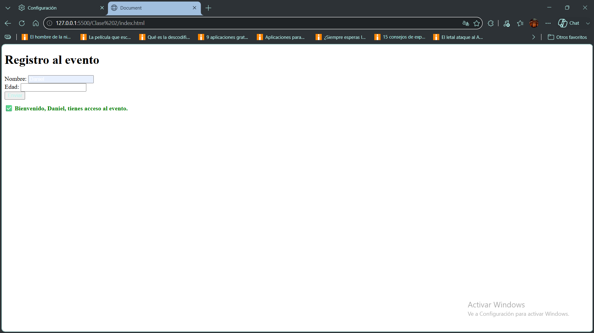
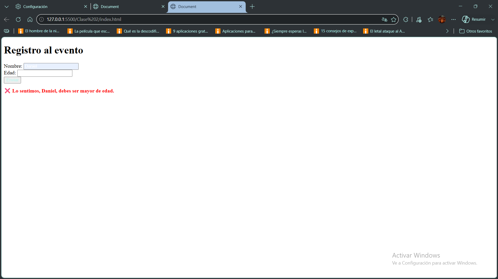

# Registro al Evento

Proyecto realizado como práctica de HTML, CSS y JavaScript.

## Descripción

El sistema permite registrar un usuario mediante un formulario donde se solicita:

- Nombre
- Edad

Al enviar el formulario, el sistema verifica si la persona es mayor o igual a 18 años.

### Resultado

- Si la edad es mayor o igual a 18 años, se muestra un mensaje de acceso permitido.
- Si la edad es menor a 18 años, se muestra un mensaje indicando que debe ser mayor de edad.

Además, el mensaje se colorea dinámicamente:

- Verde para acceso permitido.
- Rojo para acceso denegado.

---

## Tecnologías utilizadas

- HTML5
- CSS3
- JavaScript

---

## Cómo ejecutar el proyecto

### Requisitos Previos
Necesitas tener instalado un navegador web moderno (Google Chrome, Mozilla Firefox, Microsoft Edge, etc.) y opcionalmente [Git](https://git-scm.com/) en tu equipo.

### 1. Clonar el repositorio
Abre tu terminal o consola de comandos y ejecuta el siguiente comando: 
git clone "https://github.com/NDanielBarrera/Tarea-2.git"

### 2. Iniciar ejecución

Abrir el archivo:

```text
index.html
```

en cualquier navegador web moderno.

También puede ejecutarse mediante Live Server en Visual Studio Code.

### 2. Cargar datos
Al abrirse el formulario en el navegador, cargar los datos solicitados (nombre y edad) y confirmar haciendo click en el botón "Enviar".

---

## Capturas de funcionamiento

### Mensaje positivo




### Mensaje negativo



---

## Autor

Nombre: Néstor Daniel Barrera

Curso: Certificación Full Stack Web Development con React.js

Unidad N° 2: JavaScript esencial.

Institución: Centro de e-Learning UTN BA (Universidad Tecnológica Nacional Sede Buenos Aires)

Año: 2026

---

## Fuentes consultadas

- Documentación MDN Web Docs:
  - https://developer.mozilla.org/

- Documentación de JavaScript:
  - https://developer.mozilla.org/es/docs/Web/JavaScript

- Material de estudio UTN e-Learning.